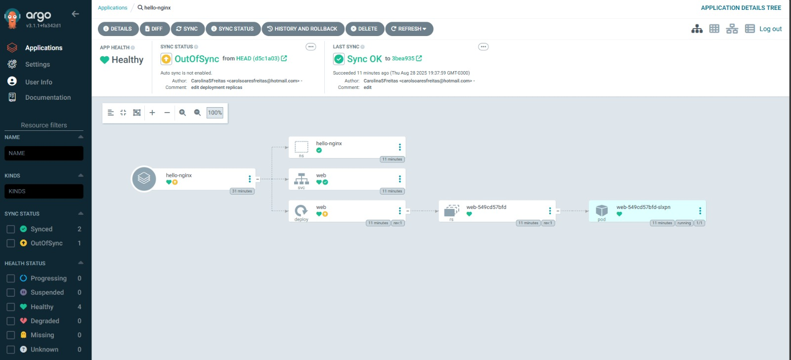
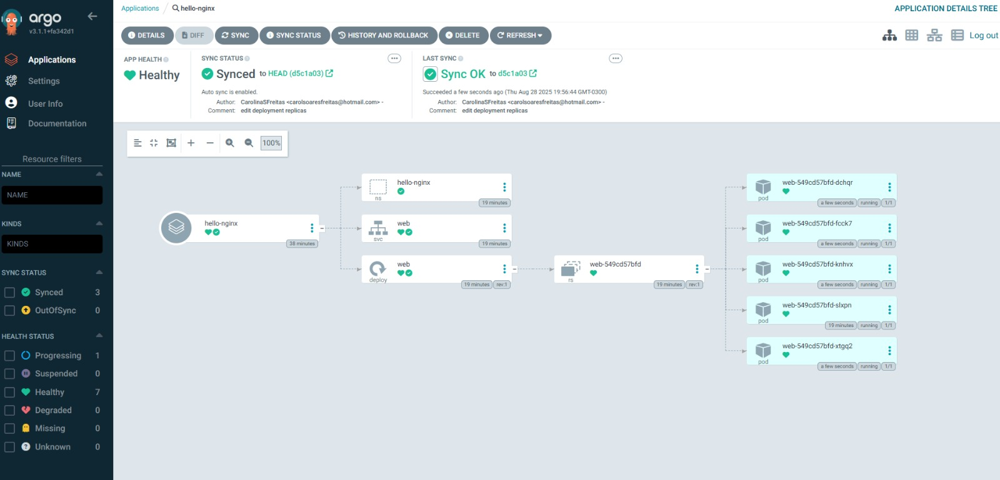

# ArgoCD | Estudo Prático

Este repositório é apenas para **prática de estudos** seguindo como base o projeto [Descomplicando ArgoCD](https://github.com/badtuxx/DescomplicandoArgoCD).

## O que é GitOps e ArgoCD?

* GitOps: **é uma forma de operar infra e aplicações usando o Git como fonte de verdade**. Toda mudança de configuração vai para o repositório, e o cluster é sincronizado a partir dele.

* ArgoCD: é a **ferramenta que implementa GitOps no Kubernetes**, reconciliando continuamente o estado declarado no Git com o estado real do cluster.

O objetivo aqui é exercitar o fluxo básico de GitOps com o ArgoCD:

* Instalar o ArgoCD em um cluster Kubernetes
* Autenticar no CLI
* Criar uma *Application* apontando para este repositório
* Sincronizar e validar um app simples (Nginx)

---

## 1) Pré‑requisitos

* Cluster Kubernetes acessível (`minikube`, `kind`, `k3d`, etc.)
* `kubectl` configurado e funcionando
* (Opcional) `argocd` CLI instalada

---

## 2) Instalar o Argo CD

Crie o namespace e aplique o manifest oficial:

```bash
kubectl create namespace argocd
kubectl apply -n argocd -f https://raw.githubusercontent.com/argoproj/argo-cd/stable/manifests/install.yaml
```

Verifique os pods:

```bash
kubectl -n argocd get pods
```

Exponha a UI (local):

```bash
kubectl -n argocd port-forward svc/argocd-server 8080:443
```

Acesse em [https://localhost:8080](https://localhost:8080).

Pegue a senha inicial:

```bash
kubectl -n argocd get secret argocd-initial-admin-secret \
  -o jsonpath="{.data.password}" | base64 -d; echo
```

Faça login via CLI (opcional):

```bash
argocd login localhost:8080 --username admin --password <SENHA> 
```

---

## 3) Subir este repositório para o GitHub

Depois de clonar e inicializar seu repositório, edite `argocd/application.yaml` e ajuste o campo:

```yaml
repoURL: https://github.com/<usuario>/<repo>.git
```

---

## 4) Criar a Application

Aplique a definição da Application:

```bash
kubectl -n argocd apply -f argocd/application.yaml
```

Verifique:

```bash
kubectl -n argocd get applications.argoproj.io
argocd app get hello-nginx
```

---

## 5) Validar o App

Veja os recursos criados:

```bash
kubectl get ns
kubectl -n hello-nginx get all
```

Teste o Nginx:

```bash
kubectl -n hello-nginx port-forward svc/web 8080:80
# abrir http://localhost:8080
```

---

## 6) Fluxo de GitOps

Faça uma alteração no diretório `manifests/` (ex.: mudar réplicas no `deployment.yaml`), dê commit e push. O Argo CD detectará e aplicará a mudança.

---

## 7) Teste de Sync Automático

No painel do Argo CD, ao acessar a Application, é possível configurar a Sync Policy. As opções são:

Enable Auto-Sync: ativa a sincronização automática sempre que houver mudanças no repositório Git.

Prune Resources: remove do cluster os recursos que foram apagados no Git, garantindo que apenas o que está versionado exista no cluster.

Self Heal: caso alguém altere manualmente um recurso diretamente no cluster, o Argo CD corrige e volta para o estado definido no Git.

### Exemplo do teste

- Antes: o Deployment estava com replicas: 1.
- Alterei no deployment.yaml para replicas: 5 e fiz commit + push.
- Sem Auto-Sync habilitado: a Application ficou com status OutOfSync até que eu habilitasse o auto-sync.
    

- Com Auto-Sync, Prune e Self Heal habilitados, o Argo CD detectou a diferença e atualizou automaticamente o cluster para 5 réplicas, sem precisar de ação manual.
    


### Sync manual x Auto-Sync

Caso o Auto-Sync não esteja habilitado, você pode forçar a sincronização manualmente com:
```
argocd app sync hello-nginx
```

Com o Auto-Sync ativado, esse comando não é necessário, o Argo CD aplica as mudanças automaticamente assim que detecta alterações no repositório.

---

## Estrutura do Repositório

```
.
├── argocd
│   └── application.yaml        # Define a Application no Argo CD
└── manifests
    ├── namespace.yaml          # Namespace do app
    ├── deployment.yaml         # Deployment Nginx
    └── service.yaml            # Service ClusterIP
```

---

## Observações

* Este repo é apenas para **estudos**, inspirado no repositório *Descomplicando ArgoCD*.
